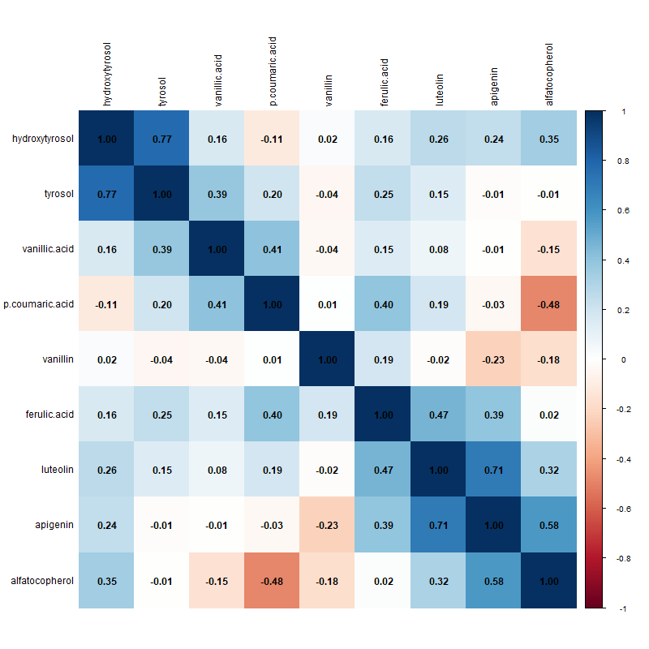
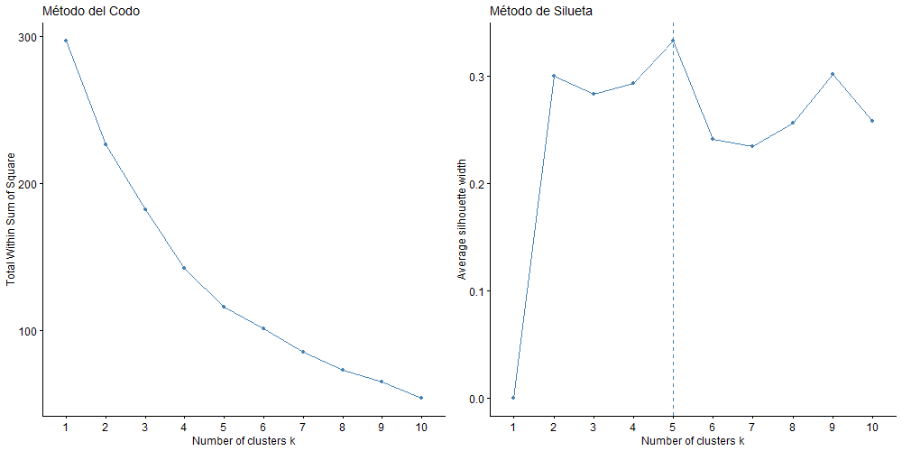
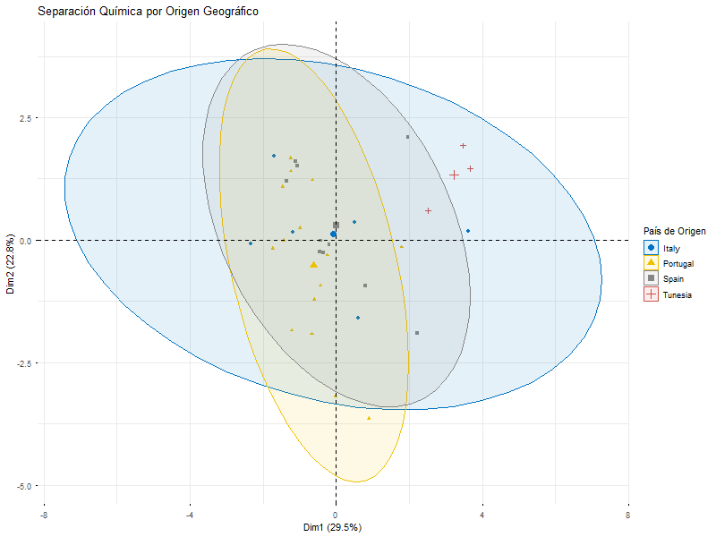
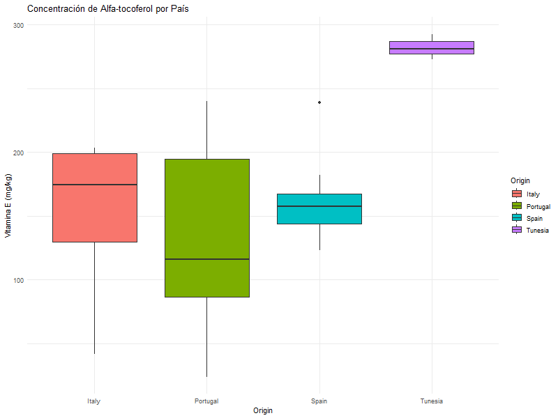
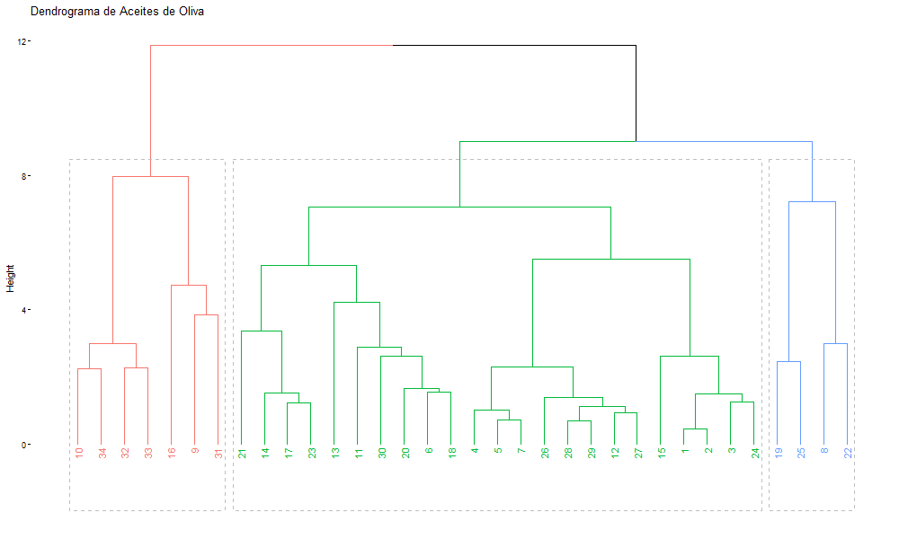

# Análisis de Perfiles Fenólicos y Clasificación de Aceites de Oliva
Este proyecto aplica técnicas de **Minería de Datos y Aprendizaje No Supervisado** para caracterizar 35 muestras de aceite de oliva de diversas regiones mediterráneas. El objetivo es validar si la composición química (fenoles y vitaminas) es suficiente para discriminar el origen y la calidad de los aceites.

---

# Resumen del Proyecto
El estudio analiza compuestos clave mediante **LC-MS** (Cromatografía de líquidos acoplada a espectrometría de masas) para identificar patrones de antioxidantes naturales que aumentan la vida útil del aceite y aportan beneficios a la salud.
**Variables clave**:
* **Perfil Fenólico**: Hidroxitirosol, Tirosol, Ácidos (Vainílico, p-cumárico, ferúlico), Flavonoides (Luteolina, apigenina).
* **Vitaminas**: $\alpha$-tocoferol (Vitamina E).

---

# Arquitectura del Repositorio

```text
EJER2/
├── data/               # Datos crudos (oil.txt)
├── scripts/            # Pipeline de R
    ├── 00_conn_r_git.R # Conexión establecida con GitHub
│   ├── 01_eda.R        # Limpieza, imputación y correlaciones
│   ├── 02_clustering.R # K-means y Hierarchical Clustering
│   └── 03_results.R    # PCA y visualización de hallazgos
├── output/             # Gráficos, tablas (.csv) y objetos R (.rds)
├── EJER2.Rproj         # Nombre del proyecto
├── .gitignore          
└── README.md
```

---

# Arquitectura del Repositorio

```text
[ INGESTA ]             [ PROCESAMIENTO ]          [ ANÁLISIS ]            [ QA & VALIDACIÓN ]          [ OUTPUTS ]
      |                      |                        |                        |                        |
      v                      v                        v                        v                        v
   oil.txt      ----->  01_eda.R         ----->  02_clustering.R  ----->  03_results.R     -----> a) Modelos Validados
 (Data Raw)          - Imputación Mediana     - K-means (K=3)          - PCA Reduction          - b) Plots de Clústeres
                     - Escalado (Z-score)     - Ward.D2 Linkage        - Boxplots de Control    - c) Dataset RDS
                     - Persistencia (.rds)    - Silhouette Valid.      - Exportación CSV        - d) Sync GitHub
```
---

# Análisis y Hallazgos Visuales
## 1. Estructura de Correlación
Antes del clustering, analizamos la relación entre variables. Se observa una correlación positiva fuerte entre el **Hidroxitirosol y el Tirosol**, componentes fundamentales de la estabilidad oxidativa.


## 2. Determinación de Clústeres Óptimos
Mediante el método de **Silueta (Silhouette)** y el **Codo (WSS)**, se identificó que **K=3** es la estructura más estable para agrupar las muestras, logrando la máxima cohesión interna.


## 3. Clasificación por Origen (Hallazgos Críticos)
El análisis de **Componentes Principales (PCA)** revela una separación clara.

> **Evidencia:** Las muestras de **Túnez (TU)** se agrupan de forma aislada en el cuadrante derecho, diferenciándose drásticamente de los aceites europeos (España, Italia, Portugal).

## 4. El factor Vitamina E ($\alpha$-tocoferol)
¿Por qué Túnez es tan diferente? El boxplot de resultados muestra que los aceites de Túnez poseen niveles de $\alpha$-**tocoferol** superiores a **270 mg/kg**, duplicando en algunos casos a las muestras de Italia o España.


## 5. Validación Jerárquica
El dendrograma confirma la jerarquía de las muestras, mostrando cómo los aceites de España y Portugal comparten similitudes estructurales en su perfil fenólico, mientras que Túnez se ramifica tempranamente.


### **Tabla de Contingencia Final**
Resultados de la asignación de clústeres vs. Origen Geográfico ver [cluster_vs_origin.csv](https://github.com/iviterirambay/Clustering_Ejercicio_3/blob/main/output/cluster_vs_origin.csv):

| Origen | Clúster 1 | Clúster 2 | Clúster 3 |
| :--- | :--- | :--- | :--- |
| España (SP) | 0 | 11 | 0 |
| Italia (IT) | 0 | 1 | 8 |
| Portugal (PO) | 0 | 8 | 0 |
| Túnez (TU) | 7 | 0 | 0 |

> **Nota:** El Clúster 1 captura exclusivamente el 100% de la producción de Túnez.

---

**Autor:** [Irwin Viteri Rambay](https://github.com/iviterirambay)
